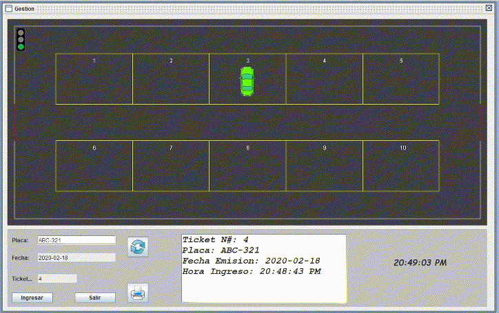

# SOFTWARE DE GESTIÓN DE PARQUEADEROS - JAVA

**Autor:** Frank Montalvo Ochoa

Este es un proyecto algo viejo, el cual funciona para gestionar un parqueadero, el sistema permite registrar clientes, generar tickets y facturas además de gestionar si los sitios se encuentran disponibles para que ingresen más vehículos. El sistema también implementa internacionalización lo que le permite intercambiar el lenguaje entre español e inglés.

En el panel de Gestión podemos ingresar nuevos vehiculas según su placa; al ingresar un nuevo vehículo este se mostrará en el panel superior de forma gráfica tal como se puede apreciar en la figura de abajo.

  

Al generar una factura para un cliente según su número de ticket, también se mostrara en el panel grafico de la parte superior tal y como se muestra en la figura de abajo.

  

